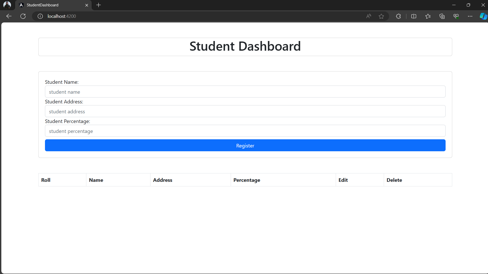
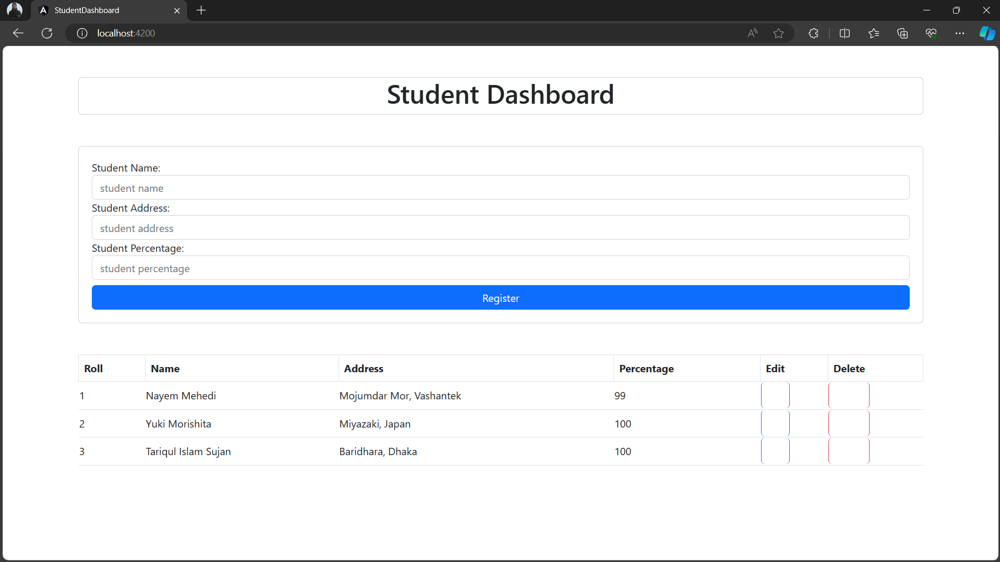

# student-dashboard-spring-angular

## Database Configs to run Backend

Configure the application.properties with your own database username(currently root) and password(currently root) as well as database name(currently world) https://github.com/Nayem73/student-dashboard-spring-angular/blob/main/spring-backend/student/src/main/resources/application.properties

## Simple way for keeping and updating students info

